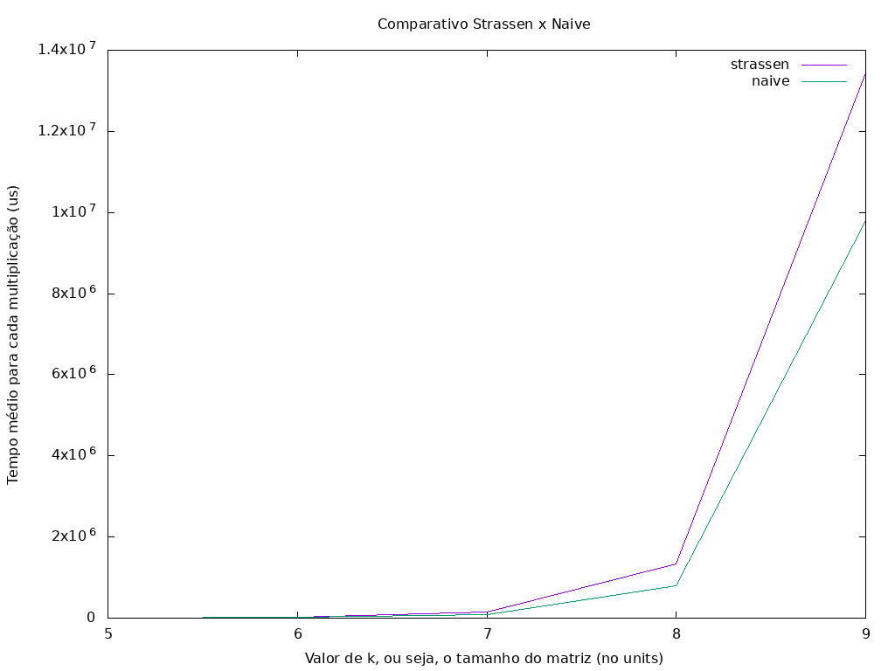

# Strassen C++

Está implementação foi desenvolvida para avaliação na disciplina de Estrutura de Dados e Análise de Algoritmos, e tem a seguinte descrição: Neste trabalho, vocês deverão implementar e comparar dois algoritmos para o cálculo do produto AB, sendo A e B duas matrizes quadradas de ordem n: o algoritmo “ingênuo”, que consiste simplesmente em aplicar diretamente a definiçãoao do produto de matrizes; e o algoritmo de Strassen, descrito no capítulo 4 do livro-texto. A comparação entre os dois algoritmos será na forma de um gráfico relativo a diversas execuções com matrizes aleatórias de ordens variáveis. Deverão ser utilizados os seguintes parâmetros, os quais serão espeficados através de um arquivo de texto:

- nmax: valor m áximo de n considerado (deve ser potências de 2);
- r: número de matrizes geradas para cada valor de n;
- [amin,amax]: intervalo ao qual os elementos das matrizes geradas devem pertencer. Todos os elementos devem ser números inteiros.

## Docker

Para execução do código os seguinte comandos devem ser executados:

### Build

````
docker build -t strassen-multiplication:latest .
````

### Running

````
docker run -v $(pwd)/output:/usr/src/app/output -it --rm --name strassen-running-app strassen-multiplication:latest
````

## Libs

A aplicação utiliza a lib [GnuPlot](http://www.gnuplot.info/) para fazer as gerações dos gráficos, ela será instalar dentro do container, mas caso desejar executar de forma de desenvolvimento, se faz necessário a instalação.

## Development

Para executar o código de forma nativa, você deve executar os seguintes comandos:

````
make
./build/application
````

## Resultados

Esta aplicação gera um gráfico comparativos entre as abordagem: naive e strassen, marcando o tempo em microsegundos, como mostra a figura abaixo. Também é gerado um arquivo do tipo csv para outros fins.



## Discussão

Como mostrado no gráfico apresentado na seção anterior, o algoritmo de Strassen para mulitplicação de matrizes leva mais tempo até um certo momento de k, onde o strassen começa a se sobresair. Vale salientar que foi utilizado um cross point = 32, ou seja, o ponto final da recursão de strassen acontece quando as matrizes chegam 32x32, nesse momento é feio a multiplicação da forma ingênua.

## Extras

Foi criado um código semelhante na linguagem [Matlab](https://www.mathworks.com/products/matlab.html), o código pode ser encontrado neste [repositório](https://google.com).

## Autor

* **Leoberto Soares**- [leossoaress](https://github.com/leossoaress)

## License

This project is licensed under the MIT License - see the [LICENSE.md](LICENSE.md) file for details
